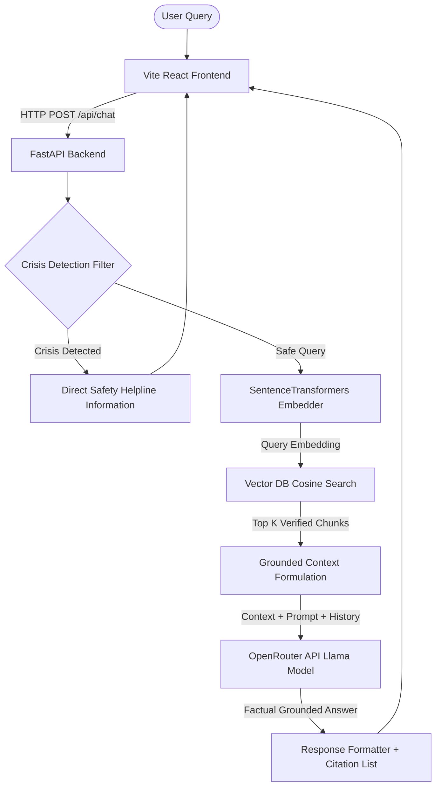

# SereneSpace — Mental Wellness RAG Chatbot

SereneSpace is a production-quality, responsive **Retrieval-Augmented Generation (RAG) Mental Wellness Chatbot**. It is designed with a clean, calming, minimal UI to help users with stress management, self-care routines, relaxation exercises, grounding techniques, and finding trustworthy professional or crisis support resources.

> [!IMPORTANT]
> **Safety Disclaimer:** This chatbot is strictly for informational and coping guidance. It is **not a replacement for professional therapy, diagnostics, or medical care.** Clear boundaries and resources are presented to the user upon entry and when crisis keywords are detected.

---

## 1. Core Architecture

The system uses a Retrieval-Augmented Generation pipeline:



---

## 2. Tech Stack

### Frontend
- **Framework:** Vite + React (JavaScript)
- **Styling:** Vanilla CSS (TailwindCSS avoided to maximize custom wellness design control)
- **Aesthetic:** Minimalist warm off-whites (`#FAF9F6`), light beiges (`#F5F3EE`), and soft sage-green accents (`#7A8B75`).
- **Features:** Responsive grids, interactive box breathing timer guide, 5-4-3-2-1 grounding checklist inputs, and customizable self-care journey schedules.

### Backend
- **Framework:** Python + FastAPI + Uvicorn
- **Payload Validation:** Pydantic v2
- **Vector Search:** Custom Numpy-based cosine similarity index (highly stable on Windows, zero compilation failures)
- **Embedding Generation:** HuggingFace `sentence-transformers/all-MiniLM-L6-v2` (runs fully local)
- **LLM Integration:** OpenRouter API calling Llama 3/3.1 Instruct models

---

## 3. Project Directory Structure

```text
mental-wellness-chatbot/
├── backend/
│   ├── app/
│   │   ├── main.py               # Main application entry point
│   │   ├── config.py             # Settings loader via pydantic-settings
│   │   ├── routes/
│   │   │   ├── chat.py           # Core RAG chat route
│   │   │   ├── health.py         # System diagnostics route
│   │   │   └── ingest.py         # Manual document ingestion route
│   │   ├── rag/
│   │   │   ├── embeddings.py     # Local SentenceTransformers wrapper
│   │   │   ├── retriever.py      # Semantic query & deduplication service
│   │   │   ├── vector_store.py   # Local Numpy Vector Database
│   │   │   └── ingestion.py      # Text splitter and indexing logic
│   │   ├── services/
│   │   │   ├── llm_service.py    # OpenRouter API requester
│   │   │   └── safety_service.py # Crisis keyword validator
│   │   └── models/
│   │       └── schemas.py        # Pydantic validation schemas
│   ├── data/
│   │   ├── documents/
│   │   │   └── seed_data.json    # Default WHO/NHS/NIMH documents
│   │   └── vector_store/
│   │       └── store.json        # Compiled vector index (gitignore excluded)
│   ├── tests/
│   │   └── test_backend.py       # API and unit test suite
│   ├── requirements.txt          # Python package list
│   └── .env.example              # Template environment file
├── frontend/
│   ├── src/
│   │   ├── components/
│   │   │   ├── Header.jsx        # Navigation bar
│   │   │   ├── Disclaimer.jsx    # Top safety banner
│   │   │   ├── LandingPage.jsx   # Informational features page
│   │   │   ├── ChatWindow.jsx    # Chat bubble interface with citations
│   │   │   ├── Exercises.jsx     # Breathing & grounding exercises
│   │   │   └── SelfCareJourney.jsx # Wizard routine planner
│   │   ├── services/
│   │   │   └── api.js            # Frontend HTTP client
│   │   ├── styles/
│   │   │   ├── variables.css     # CSS color variables & style tokens
│   │   │   └── App.css           # Core styling and animation rules
│   │   ├── App.jsx               # App layout router
│   │   └── main.jsx              # React DOM render entrypoint
│   ├── package.json              # NPM package list
│   └── vite.config.js            # Vite configurations
├── .gitignore                    # Workspace gitignore rules
└── README.md                     # Documentation
```

---

## 4. Environment Variables

Rename `backend/.env.example` to `backend/.env` and edit it to include your credentials:

```ini
# OpenRouter Configuration
# Create a key at https://openrouter.ai/
OPENROUTER_API_KEY=your_openrouter_api_key_here
OPENROUTER_MODEL=meta-llama/llama-3-8b-instruct:free

# RAG Configuration
VECTOR_DB_PATH=./data/vector_store
TOP_K=4

# Server Configuration
PORT=8000
HOST=127.0.0.1
```

*Note:* If `OPENROUTER_API_KEY` is omitted or left as default, the backend will operate in a **fallback mock/local display mode**, directly showing the retrieved verified references.

---

## 5. Development & Startup Commands

### Backend Setup

1. Navigate to the backend folder:
   ```powershell
   cd backend
   ```

2. Create a virtual environment:
   ```powershell
   python -m venv venv
   ```

3. Activate the virtual environment:
   - **Windows PowerShell:**
     ```powershell
     venv\Scripts\Activate.ps1
     ```
   - **Windows Command Prompt (CMD):**
     ```cmd
     venv\Scripts\activate.bat
     ```

4. Install dependencies:
   ```powershell
   pip install -r requirements.txt
   ```

5. Run tests:
   ```powershell
   pytest tests/
   ```

6. Start the FastAPI development server:
   ```powershell
   uvicorn app.main:app --reload --port 8000
   ```
   *Note: On first startup, the app will download `all-MiniLM-L6-v2` (~120MB) and automatically ingest `seed_data.json`.*

### Frontend Setup

1. Open a new terminal and navigate to the frontend folder:
   ```powershell
   cd frontend
   ```

2. Install npm dependencies:
   ```powershell
   npm install
   ```

3. Run the development server:
   ```powershell
   npm run dev
   ```

4. Open the application in your browser at:
   `http://localhost:5173/`

---

## 6. API Endpoint Specifications

### `GET /api/health`
- **Description:** Verifies API health and checks if vector database is loaded with segments.
- **Response Schema:**
  ```json
  {
    "status": "healthy",
    "vector_store_loaded": true
  }
  ```

### `POST /api/chat`
- **Description:** Sends prompt query. Checks safety triggers, queries the vector database, and prompts OpenRouter.
- **Request Schema:**
  ```json
  {
    "message": "Give me a 5-minute breathing exercise.",
    "history": [
      {"role": "user", "content": "I am feeling stress."},
      {"role": "assistant", "content": "Here is what you can try..."}
    ]
  }
  ```
- **Response Schema:**
  ```json
  {
    "response": "Here is a 5-minute box breathing routine...",
    "sources": [
      {
        "title": "Box Breathing Technique for Anxiety",
        "organization": "NHS",
        "url": "https://www.nhs.uk/mental-health/...",
        "topic": "relaxation exercises"
      }
    ]
  }
  ```

### `POST /api/ingest`
- **Description:** Manually indexes additional verified documents into the database.
- **Request Schema:**
  ```json
  [
    {
      "title": "Topic Title",
      "content": "Full text copy...",
      "source": "Source Name",
      "url": "https://...",
      "organization": "WHO",
      "topic": "stress"
    }
  ]
  ```

---

## 7. RAG & Groundedness Rules

1. **Local Embeddings:** The user's query is converted to a vector locally using SentenceTransformers to protect query indexing privacy.
2. **Strict Grounding Prompt:** System prompts force the Llama model to answer using only the context block. If the context does not supply the answer, the model responds with:
   *"The available verified sources do not provide enough information to answer this."*
3. **Keyword Safety Override:** If severe distress or self-harm keywords match, the server stops LLM execution entirely, returning predefined crisis hotline guidelines.
4. **Deduplicated Citations:** Each response exposes its clinical source documents, including clickable URLs leading back to authoritative agencies (WHO, NHS, CDC, NIMH, APA).
